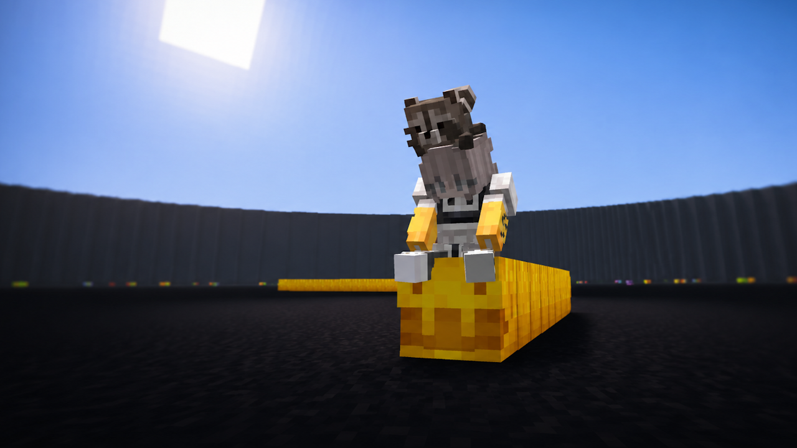
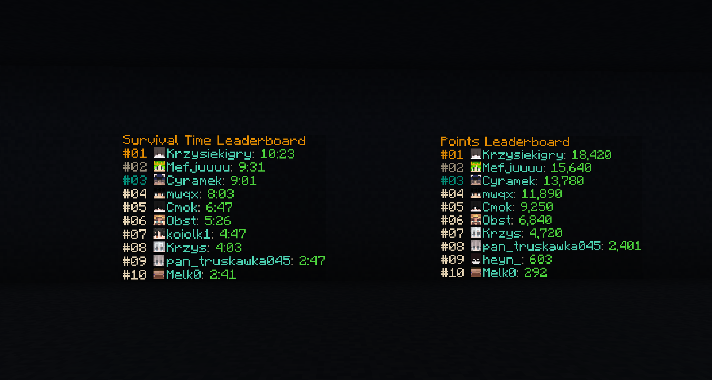
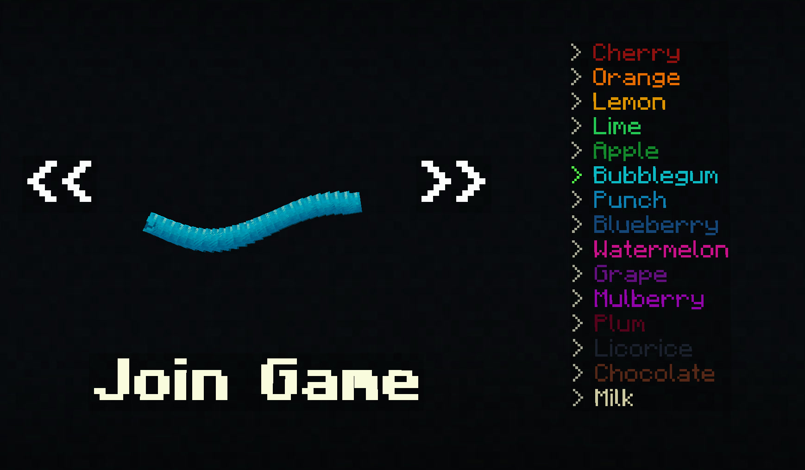

# Slither.io in Minecraft

**Slither.io in Minecraft** is a custom Minecraft minigame where players take control of a growing worm, collect food,
spend mass to boost, and eliminate other players by forcing them into a body segment or the arena wall.

It uses custom fork of paper for QOA and MongoDB for persistance.

## Lobby and Leaderboards

The leaderboards use Minecraft text displays and display 8×8 player-head images without any resourcepacks.

The main menu is a gui built with text displays and packets.

